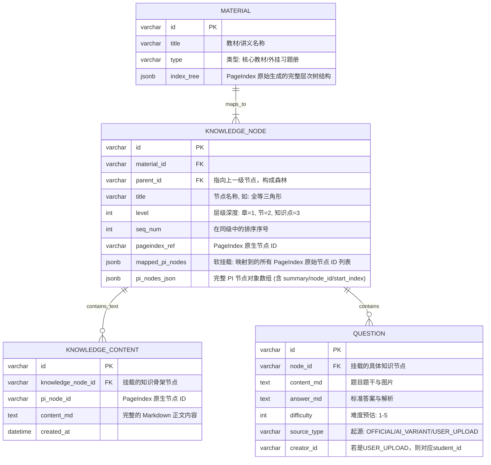
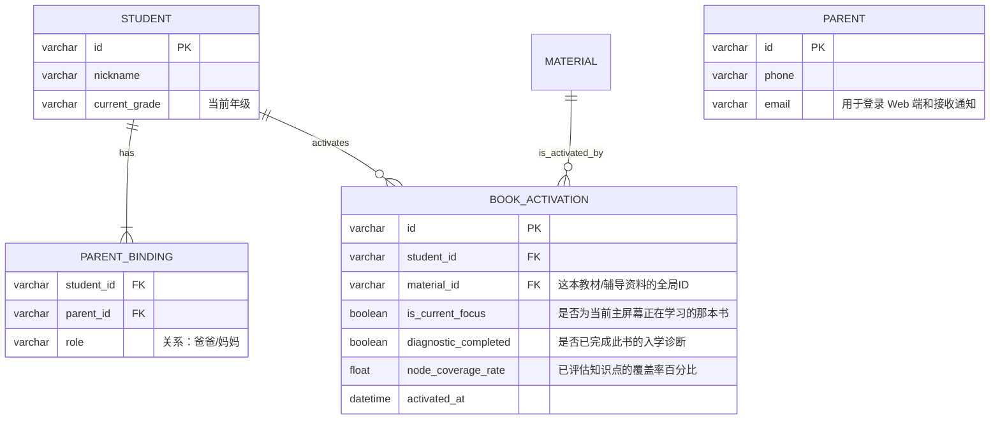
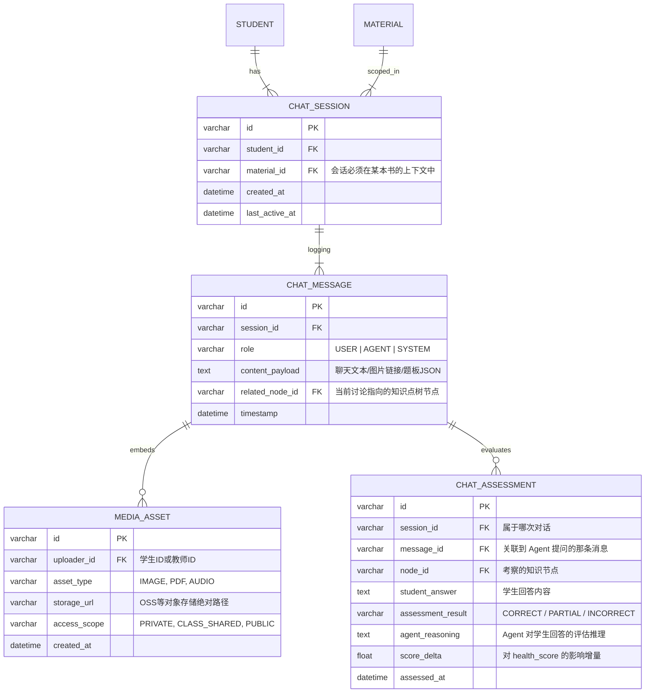
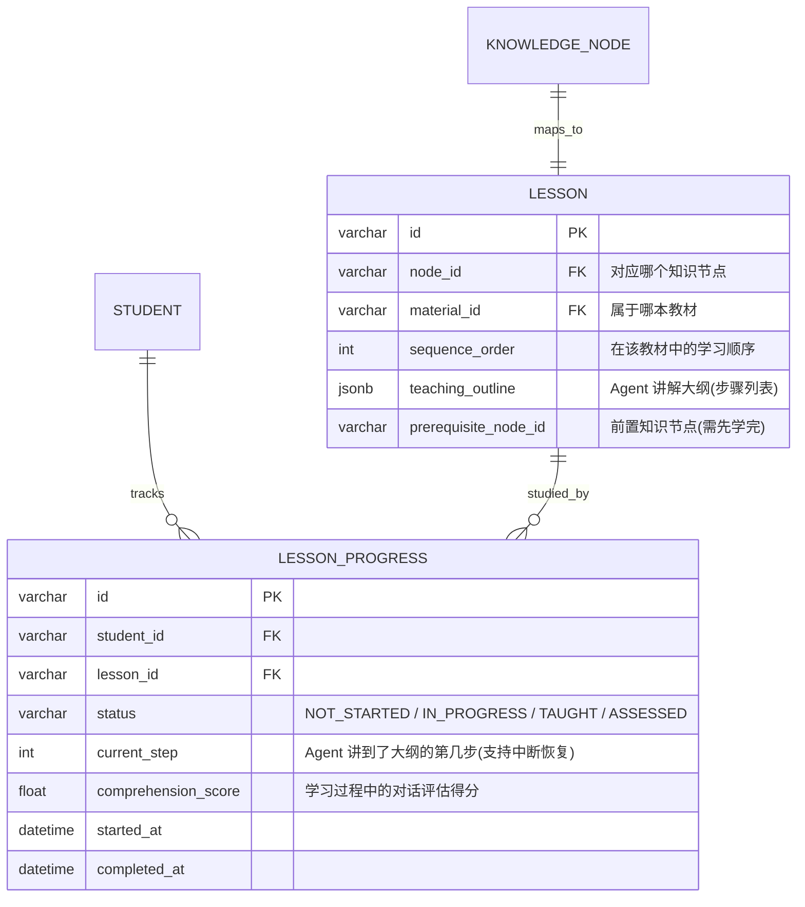
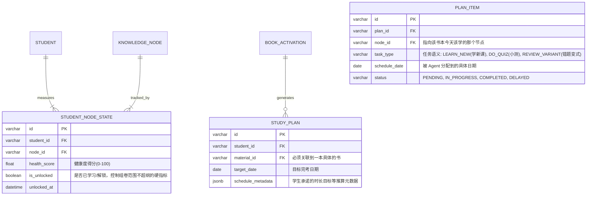
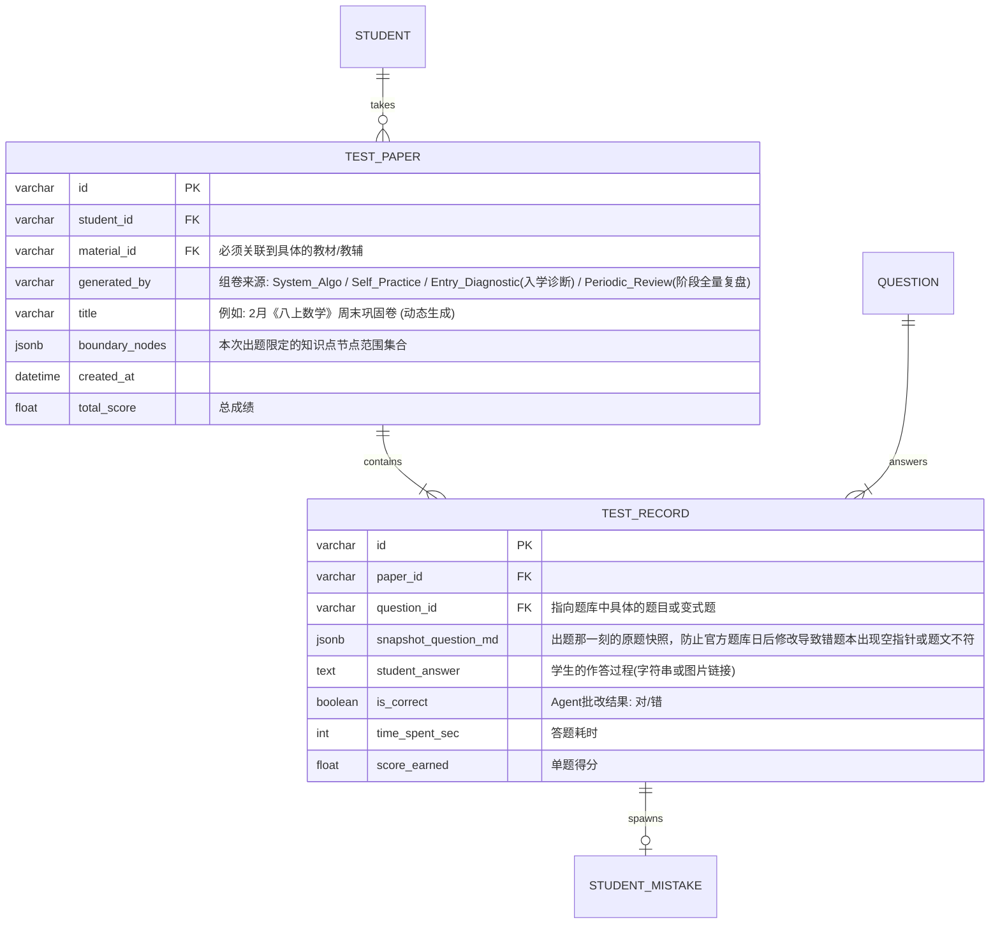
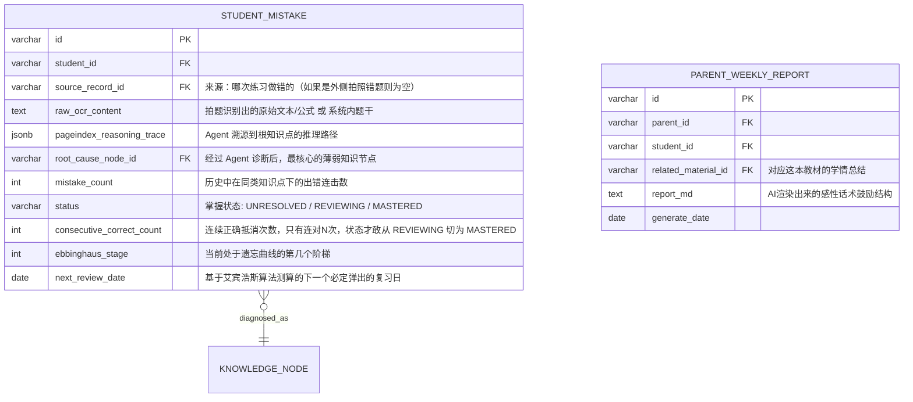

# 智树 (TreeEdu) 系统核心数据架构设计 (Database Schema & ER Model)

作为一款以 PageIndex 树状知识库 + 动态智能规划驱动的教育产品，底层的**数据结构建模 (Data Modeling)** 是支撑交互流程和前端呈现的基石。

本文档定义了 V1.0 阶段的最简可行 (MVP) 实体关系模型（Entity-Relationship Model）。我们采用关系型数据库（如 PostgreSQL）结合部分文档型存储（JSONB 用于灵活节点扩展）的混合设计思路。

---

## 核心数据模块划分

整个数据架构可以拆解为三大核心领域 (Domain)：

1. **资源与知识树网络 (Knowledge & Resource Domain)**
2. **用户与关系拓扑 (Identity & Relationship Domain)**
3. **学情追踪与动态日程 (Learning State & Scheduling Domain)**

---

## 1. 资源与知识树网络 (Knowledge & Resource Domain)

这是对接 PageIndex 的核心元数据模型。

**设计解读：**
不采用传统的一张扁平表存所有章节，而是使用**自引用 (Self-referencing) 的 `KNOWLEDGE_NODE` 树状表**。

> [!IMPORTANT]
> **V1.1 骨肉分离重构**：`KNOWLEDGE_NODE` 不再存储完整正文 `content_md`，而是只保留轻量骨架索引 `pi_nodes_json`。真正的富文本内容被拆分到 `KNOWLEDGE_CONTENT` 表中（一对多关系）。这一设计使得检索时只加载摘要级信息（节省 Token），需要全文时再按 `pi_node_id` 精准取回。

通过在 `QUESTION` 中引入强力的 `source_type` 隔离，保证了后续动态组卷选定基准骨架时，永远只从干净的 OFFICIAL 题库抽取源数据，不至于产生"垃圾进垃圾出"的污染。

---

## 2. 用户与书架拓扑 (Identity & Bookshelf Domain)

实现 V1.0 中 “C 端学生自主选书 + 家长柔性陪伴” 的拓扑。这里最关键的就是**选书动作**。学生不能凭空学习，必须先“点亮/激活”一本教材。

**设计解读：**
* 增加 `BOOK_ACTIVATION` 表：这就是前台 UI 中“我的书包 (My Bookshelf)”。学生所有的行为上限，受限于他激活了哪些 `material_id`。
* `is_current_focus` 字段控制了 UI 顶部那个核心的 **“当前正在学习：📘《XXX》”** 胶囊。当切换此字段，整个应用的聊天上下文、知识树、错题本数据全盘切换。

---

## 3. 会话与上下文网络 (Chat & Context Domain)

为了实现跨设备 Web（PC、Pad、Mobile）对苏格拉底学习过程的无缝恢复，必须存在持久化的对话结构支撑多模态 Agent。

**设计解读：**
* **`CHAT_ASSESSMENT`（对话评估记录）**：Agent 在苏格拉底对话或辅助学习中主动提问时，系统将问答结果记录为轻量级评估。`assessment_result` 区分完全正确/部分正确/错误，`score_delta` 直接反馈到 `STUDENT_NODE_STATE.health_score`。这与 `TEST_RECORD` 形成"隐式+显式"双轨评估体系。

---

## 3.5 课程与学习进度领域 (Lesson & Progress Domain)

为了支撑"按教材课程大纲学习"的辅助学习核心功能，需要将知识树节点映射为可学习的课程单元，并精细追踪学生的学习进度（支持中断恢复）。

**设计解读：**
* **`LESSON`（课时/学习单元）**：将知识树每个叶子节点映射为一个可学习的"课程"。`sequence_order` 确保按教材顺序呈现课程大纲列表。`teaching_outline` 以 JSONB 存储 Agent 讲解的步骤列表（导入→讲解→例题→练习→小结）。`prerequisite_node_id` 控制解锁顺序——前置课程未完成时，后续课程保持锁定。
* **`LESSON_PROGRESS`（学生课程进度）**：`current_step` 是实现"中断恢复"的关键——学生中途退出后，再次进入时 Agent 从该步骤接续。`status` 四态流转：NOT_STARTED → IN_PROGRESS → TAUGHT（Agent 讲完）→ ASSESSED（巩固练习通过）。

## 4. 学情追踪与动态日程 (Learning State & Scheduling Domain)

这是动态排期引擎和艾宾浩斯复习算法的数据来源。**注意：所有的进展和计划，都严格限定在一本具体的书(`material_id`)内。**

**设计解读：**
* **组卷硬锁 (`is_unlocked`)**：Agent 在扫描知识库薄弱项自动组卷时，此标志可以完美拦截该生“还没学过的节点”，防止打击信心引发负面体验。
* **清晰可渲染 (`task_type`)**：计划卡片带有特定的指令类别，有助于前端进行特定卡片微件的展示。
## 5. 测试与答题记录领域 (Testing & Assessment Domain)

为了支撑 PRD 中“千人千卷动态生成”与“日常习题演练”的需求，我们必须设计一套能够长期追踪学生具体答题行为的结构。这也是系统形成闭环（练习 -> 成绩 -> 错题 -> 节点变黄 -> 复习计划）的源头。

**设计解读：**
* **动态生成的载体 `TEST_PAPER`**：Agent 给学生出的每一套“千人千卷”周末卷，或者每天计划中包含的 5 道每日测验，在底层都会生成一条 `TEST_PAPER` 记录。这既是学生回顾成绩的载体，也是系统追溯评估质量的依据。
* **数据造血机与快照隔离 `TEST_RECORD`**：这是系统中数据量最大、价值最高的表。Agent 批改后，如果 `is_correct` 为 False，系统就会根据这个动作，自动生成一条记录到下方的 `STUDENT_MISTAKE` 错题本中。耗时指标 (`time_spent_sec`) 也能提供给健康度算法。`snapshot_question_md` 保证了即使源题库大洗牌，学生的历史试卷依然完美还原。

---

## 6. 错题图谱与 PageIndex 的双向映射机制 (Error-to-Tree Mapping)

用户提出了一个非常核心的技术难点：**“如何把个人的错题库也变成 PageIndex 结构，让 Agent 借此知道学生哪里没掌握并进行分解？”**

结合 `VectifyAI/PageIndex` 的原理，我们设计了如下**反向挂载算法**：

### 6.1. 错题并不是一棵“新树”，而是对“标准树”的降维投射

不需要为每个学生的错题单独建一棵完整的 PageIndex 树。相反，错题库更像是从 `TEST_RECORD` 流转而来，并最终**挂载 (Mount)** 在系统标准核心树 (`KNOWLEDGE_NODE`) 上的“发病叶子”。

### 6.2. 错题定位与分解流程 (The "Diagnosing" Flow)
当学生在系统中做错一道题，或上传一张错题照片时：

1. **多模态解析 (OCR + Vision LLM)**：将学生错题图片转为文本公式（放入 `raw_ocr_content`）。
2. **反向树状推理 (Reverse Tree-Search)**：
   * 这是 PageIndex 最擅长的。Agent 拿着这道错题的文本，去遍历这本教材的 PageIndex 树。
   * **Agent 内部思考链 (Reasoning)**：“这道题包含特征项 $v^2 - v_0^2 = 2ax$。在《高一物理》这棵树中，该特征匹配到了 [必修一] -> [第三章] -> [第二节] 这个节点。”
3. **更深粒度的分解 (Node Decomposition)**：
   * 如果 Agent 发现学生在这个大节点下反复出错，Agent 会读取该 `KNOWLEDGE_NODE` 内部更细的子知识点（比如：符号正负号判断错误、公式变形错误）。
   * Agent 计算出该生的 `root_cause_node_id`（根本原因节点）。
4. **状态闭环与干预**：
   * 系统将该关联节点的 `STUDENT_NODE_STATE.health_score` 扣分（节点在前端变红）。
   * 次日，Agent 制定计划时，看到变红的节点，进入“造题池”抽取同类变式题，塞入明天的 `TEST_PAPER` 中进行测试。测试做对了，错题表的状态设为 `MASTERED`。

---

## 下一步行动方案 (Next Actionable Steps)

至此，用于支撑智树（TreeEdu）产品从**计划 -> 练习 -> 批改 -> 错题沉淀 -> 再次排期** 数据闭环的所有底层 ER 实体模型均已确立。接下来进入工程架构阶段。
