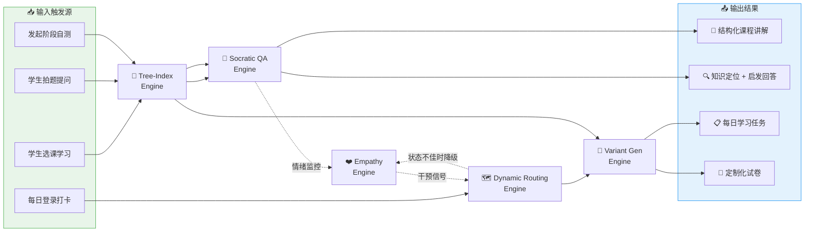
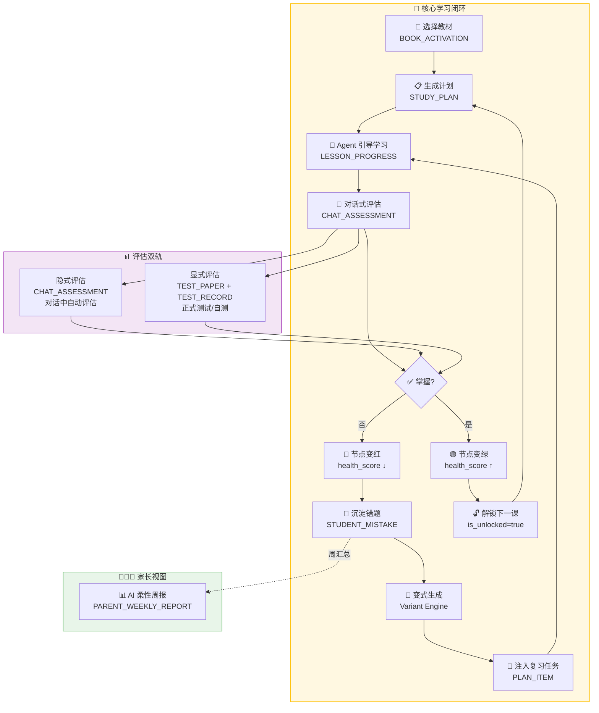
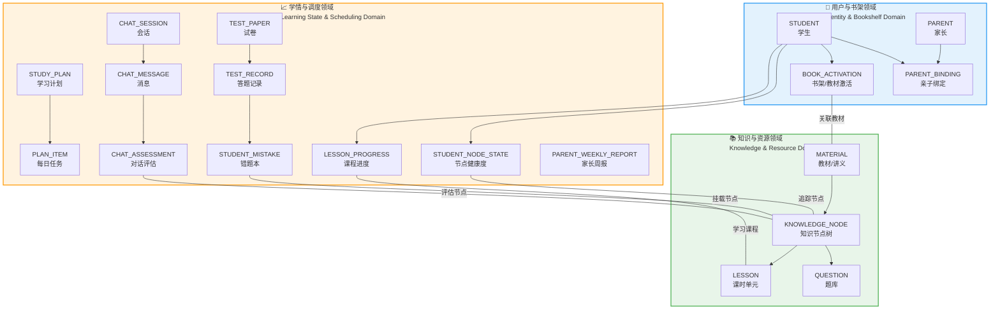
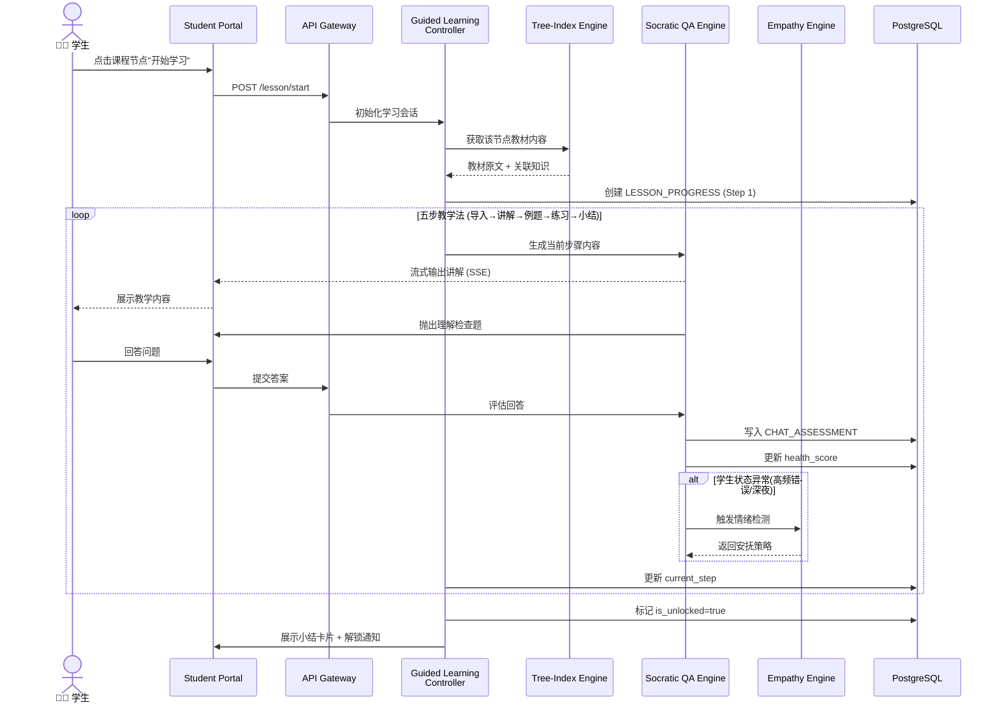
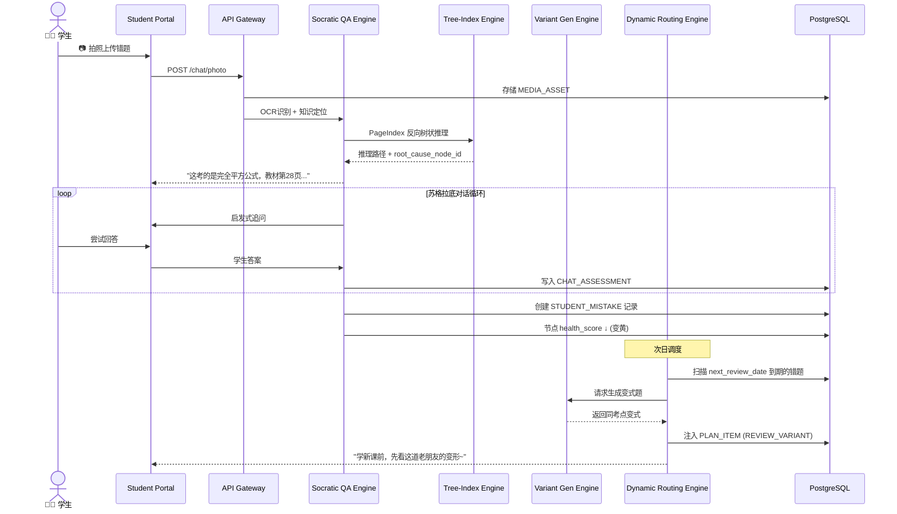
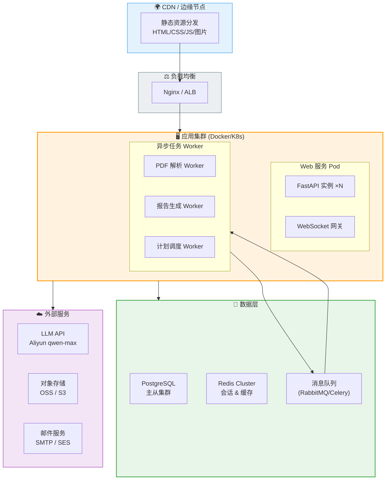

# 智树 (TreeEdu) Agent - 系统架构设计 (System Architecture)

> **文档状态**：V1.0 架构终稿 | **更新日期**：2026-02-25

---

## 1. 系统全景架构 (System Overview)

下图展示了智树系统从终端用户到底层基础设施的完整分层架构。

```mermaid
graph TB
    subgraph Clients["🖥️ 接入层 (Client Layer) — 响应式 Web/PWA"]
        direction LR
        SP["👩‍🎓 Student Portal<br/>PC · Pad · Mobile H5"]
        PP["👨‍👩‍👧 Parent Portal<br/>Web 仪表盘"]
        AP["🔧 Admin Dashboard<br/>PC 端运维"]
    end

    subgraph Gateway["🌐 网关与通信层 (API Gateway & Realtime)"]
        direction LR
        REST["REST API<br/>(FastAPI)"]
        WS["WebSocket / SSE<br/>(流式对话)"]
        AUTH["Auth & RBAC<br/>(JWT / OAuth2)"]
    end

    subgraph BizLayer["⚙️ 业务中台 (Business Logic Layer)"]
        direction TB
        subgraph AgentOrch["🤖 Agent 编排层"]
            SO["Socratic Orchestrator<br/>苏格拉底对话编排"]
            GL["Guided Learning Controller<br/>引导学习控制器"]
            AR["Adaptive Router<br/>自适应路由引擎"]
        end
        subgraph BizServices["📦 业务服务层"]
            PS["Plan Service<br/>学习计划管理"]
            TS["Test Service<br/>组卷 & 批改"]
            MS["Mistake Service<br/>错题管理"]
            RS["Report Service<br/>家长周报生成"]
            BS["Bookshelf Service<br/>书架管理"]
        end
    end

    subgraph CoreEngines["🧠 AI 核心引擎层 (Core AI Engines)"]
        direction LR
        VCM["👁️ V-Catalog Engine<br/>视觉提取引擎<br/>· 截取排版提取真实目录"]
        TIE["🌳 Tree-Index Engine<br/>树状索引引擎<br/>· PageIndex 黑盒切树<br/>· Dual-Tree 语义关联映射"]
        DRE["🗺️ Dynamic Routing Engine<br/>动态规划引擎<br/>· 基准计划生成<br/>· 每日任务调度"]
        SQE["💬 Socratic QA Engine<br/>苏格拉底问答引擎<br/>· 启发式对话<br/>· 树内限定作答"]
        VGE["🎲 Variant Gen Engine<br/>变式生成引擎<br/>· 同考点换皮<br/>· 难度可控出题"]
        EME["❤️ Empathy Engine<br/>共情与鼓励引擎<br/>· 情绪状态监控<br/>· 正向强化干预"]
    end

    subgraph Foundation["🏗️ 基础设施层 (Infrastructure Layer)"]
        direction LR
        LLM["🤖 大模型网关<br/>GPT-4o / Gemini<br/>多模态推理"]
        PIX["📚 PageIndex<br/>无向量树状 RAG<br/>知识树检索"]
        PG["🐘 PostgreSQL<br/>关系型数据库<br/>+ JSONB 文档"]
        OSS["☁️ 对象存储 (OSS)<br/>图片 / PDF<br/>媒体资源"]
        CACHE["⚡ Redis<br/>会话缓存<br/>计划热数据"]
    end

    Clients --> Gateway
    Gateway --> BizLayer
    BizLayer --> CoreEngines
    CoreEngines --> Foundation

    style Clients fill:#E8F5E9,stroke:#4CAF50,stroke-width:2px
    style Gateway fill:#E3F2FD,stroke:#2196F3,stroke-width:2px
    style BizLayer fill:#FFF3E0,stroke:#FF9800,stroke-width:2px
    style CoreEngines fill:#F3E5F5,stroke:#9C27B0,stroke-width:2px
    style Foundation fill:#ECEFF1,stroke:#607D8B,stroke-width:2px
```

---

## 2. 核心引擎协作拓扑 (Engine Collaboration Topology)

五大核心引擎并非各自为战，而是在不同学习场景下形成特定的**协作编排模式**。

---

## 3. 数据流架构 (Data Flow Architecture)

系统最核心的数据闭环：**学习 → 评估 → 沉淀 → 再规划**。

---

## 4. 技术栈选型 (Technology Stack)

```mermaid
graph LR
    subgraph Frontend["🎨 前端"]
        direction TB
        F1["Vue 3 / React"]
        F2["ECharts / D3.js<br/>知识树可视化"]
        F3["PWA + 响应式布局"]
        F4["WebSocket Client<br/>流式对话"]
    end

    subgraph Backend["⚙️ 后端"]
        direction TB
        B1["Python / FastAPI"]
        B2["SQLAlchemy ORM"]
        B3["LangChain / LangGraph<br/>Agent 编排"]
        B4["PageIndex Local<br/>树状 RAG"]
    end

    subgraph Infra["🏗️ 基础设施"]
        direction TB
        I1["PostgreSQL + JSONB"]
        I2["Redis 缓存"]
        I3["阿里云 OSS / S3"]
        I4["Docker + K8s"]
    end

    subgraph AI["🧠 AI 服务"]
        direction TB
        A1["Aliyun qwen-max / 通义千问"]
        A2["多模态 OCR + VLM<br/>(通义/视觉识别提取目录)"]
        A3["PageIndex 树检索引擎"]
        A4["Dual-Tree Mappper<br/>双树语义映射器"]
    end

    Frontend --> Backend --> Infra
    Backend --> AI

    style Frontend fill:#E3F2FD,stroke:#2196F3,stroke-width:2px
    style Backend fill:#FFF3E0,stroke:#FF9800,stroke-width:2px
    style Infra fill:#ECEFF1,stroke:#607D8B,stroke-width:2px
    style AI fill:#F3E5F5,stroke:#9C27B0,stroke-width:2px
```

---

## 5. 数据领域模型总览 (Domain Model Overview)

数据架构按**三大核心领域**组织，覆盖从知识资源到学情追踪的完整生命周期。

---

## 6. 核心场景时序图 (Key Scenario Sequence Diagrams)

### 6.1 场景：Agent 引导式课程学习

### 6.2 场景：拍题 → 错题溯源 → 复习闭环

---

## 7. 部署架构 (Deployment Architecture)

---

## 8. 安全与隔离策略 (Security & Isolation)

| 维度 | 策略 | 实现方式 |
|:---|:---|:---|
| **身份认证** | JWT Token + 刷新令牌机制 | FastAPI Security + OAuth2 |
| **角色隔离** | 学生/家长/管理员三级 RBAC | 中间件路由级别拦截 |
| **数据隔离** | 学生数据按 `student_id` 严格隔离 | 数据库行级安全策略 (RLS) |
| **媒体安全** | 用户上传图片防盗链 + 访问签名 | OSS 签名 URL，过期时间 15min |
| **知识边界** | Agent 回答严格限制在教材树内 | PageIndex 树搜索 + Prompt 注入防护 |
| **组卷防超纲** | `is_unlocked` 硬锁校验 | 数据库查询级强制过滤 |
| **快照保护** | 试卷题面物理快照，不受源库变动影响 | `snapshot_question_md` JSONB 静态化 |

---

## 9. 性能与扩展性设计 (Performance & Scalability)

| 关注点 | 设计方案 |
|:---|:---|
| **流式响应** | LLM 输出通过 SSE/WebSocket 实时推送，首字延迟 < 500ms |
| **知识树缓存** | 高频访问的教材知识树缓存至 Redis，TTL 24h |
| **异步解析** | PDF 上传后异步 Worker 处理，不阻塞主线程 |
| **弹性扩缩** | K8s HPA 基于 CPU/内存自动扩缩 Web Pod |
| **数据库优化** | `KNOWLEDGE_NODE` 树结构使用物化路径 + 递归 CTE 优化查询 |
| **LLM 成本控制** | 分级调用策略：简单判断用轻量模型，深度推理用 Aliyun qwen-max |
