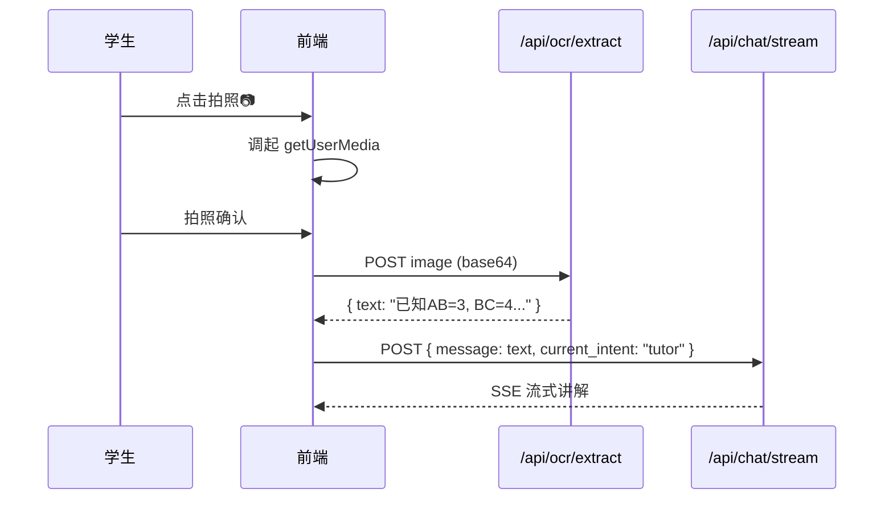
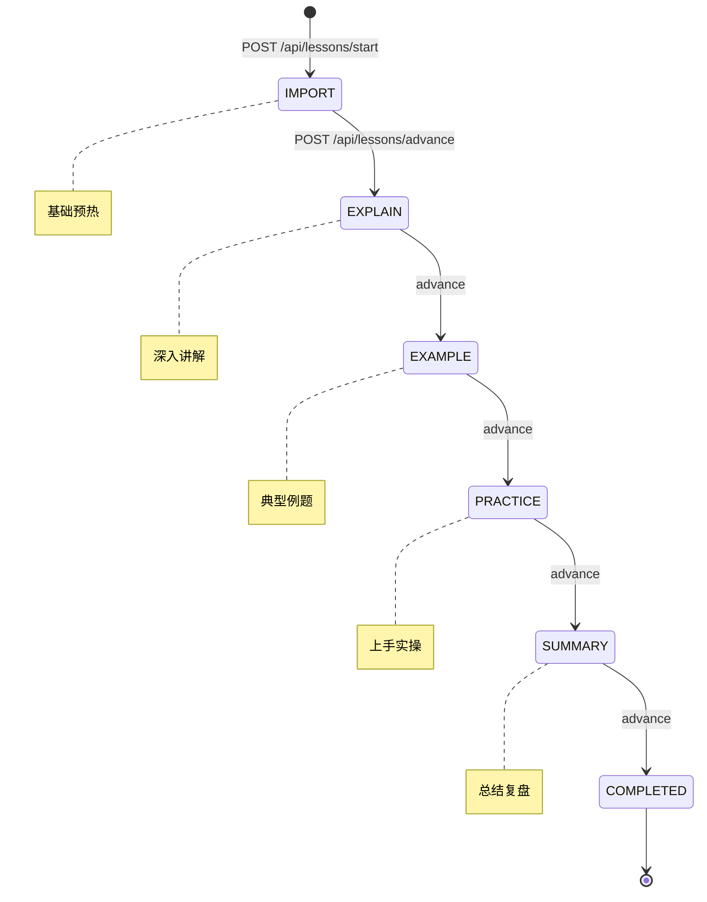

# 智树 (TreeEdu) Agent - 前端 UI 与组件架构设计 (V3 — 审计修复版)

> **文档状态**：V3 审计修复版。已修复 SSE 接入协议错误、API 路径不一致等问题，补充了认证体系、学习计划、入学诊断、考试等缺失页面设计，锁定 React 技术选型。本文档作为 Milestone 4 前端开发的唯一蓝本。

---

## 1. 前端技术选型 (锁定)

| 维度 | 选型 | 说明 |
|:---|:---|:---|
| **框架** | React 18 + Vite | SPA 架构，HMR 极速开发 |
| **路由** | React Router v6 | 嵌套路由 + 路由守卫 |
| **状态管理** | Zustand | 轻量级，按领域拆分 Store |
| **UI 组件库** | Ant Design 5 | 组件丰富、响应式支持好 |
| **知识树可视化** | ECharts for React | 树图 + 力导向图，移动端手势缩放 |
| **Markdown / LaTeX** | react-markdown + KaTeX | 支持数学公式即时渲染 |
| **SSE 客户端** | @microsoft/fetch-event-source | 支持 POST + 自定义 Headers (原生 EventSource 仅支持 GET) |
| **HTTP 客户端** | Axios | 拦截器统一处理 Token 和错误 |
| **构建 / PWA** | Vite + vite-plugin-pwa | 离线缓存 + 安装提示 |

### 1.1 状态管理架构 (Zustand Store 拆分)

```text
src/stores/
├── useAuthStore.ts       # JWT Token + 当前用户身份 (学生/家长/管理员)
├── useBookshelfStore.ts  # 书架列表 + 当前焦点教材
├── useChatStore.ts       # SSE 会话 + 消息列表 + Agent 状态
├── useLessonStore.ts     # 闯关进度 (current_step)
├── useTreeStore.ts       # 知识树结构 + 全量节点状态 (health_score/is_unlocked)
├── useMistakeStore.ts    # 错题本 (全量 + 到期复习)
└── usePlanStore.ts       # 学习计划 + 每日任务列表
```

---

## 2. 核心页面拓扑与路由映射

系统采用**响应式 Web 架构 (PWA / Mobile H5 / PC / Pad)**。一切功能围绕"特定教材"展开。

### 2.0 认证体系 (Auth)

| 页面 | 路由 | 对接 API | 核心功能 |
|:---|:---|:---|:---|
| 登录 | `/login` | `POST /api/auth/login` (待建) | 手机号+验证码 / 账号密码登录 |
| 注册 | `/register` | `POST /api/students/` | 学生注册，设置昵称/年级 |
| 家长绑定 | `/parent/bindx` | `POST /api/auth/bind-parent` (待建) | 扫码或输入绑定码关联学生 |

> **Token 管理**：前端使用 Axios 拦截器在每次请求的 `Authorization` Header 中携带 JWT。Token 过期时自动调用 `/api/auth/refresh` 静默续期。路由守卫 (`RequireAuth` 组件) 拦截未登录用户跳转至 `/login`。

### 2.1 系统后台 (Admin Dashboard) - PC 端

| 页面 | 路由 | 对接 API |
|:---|:---|:---|
| 教材库管理 | `/admin/library` | `POST /api/materials/`、`GET /api/materials/` |
| 知识树校验台 | `/admin/tree-validator/:id` | `GET /api/materials/{id}/tree` |
| 触发建树 | — | `POST /api/materials/build-tree` |

### 2.2 学生端 (Student Portal) - 响应式多端

| 页面 | 路由 | 对接 API | 核心功能 |
|:---|:---|:---|:---|
| 统一书架 | `/bookshelf` | `GET /api/students/{id}/bookshelf`、`POST /api/students/activate-book` | 激活教材、设定主干 |
| 今日任务 | `/today` | `GET /api/plans/{planId}/items?date=today` (待建) | 每日学习/复习/练习任务卡片 |
| 学习计划 | `/plan/:materialId` | `GET /api/lessons/plans/{student_id}`、`POST /api/lessons/plans/generate` | 日历视图 + 任务列表 + 月份切换 |
| 微测 | `/quiz/:nodeId` | `POST /api/quizzes/generate`、`POST /api/quizzes/submit`、`GET /api/quizzes/unfinished/{student_id}/{node_id}` | 智能微测、答题、结果 |
| 课程大纲 | `/outline/:materialId` | `GET /api/materials/{id}/tree`、`GET /api/students/{id}/node-states` (待建) | 知识树列表视图 |
| 入学诊断 | `/diagnostic/:materialId` | `POST /api/chat/stream` (`intent: assessor`) | 诊断考卷 + 进度条 + 结果 |
| 学习舱 | `/cabin/:sessionId` | `POST /api/chat/stream` (SSE)、`POST /api/chat/` | Agent 对话、五步闯关 |
| 闯关进度 | — (嵌入学习舱) | `POST /api/lessons/start`、`POST /api/lessons/advance` | 五步状态机 UI |
| 考试/答题 | `/exam/:paperId` | `POST /api/chat/stream` (`intent: variant`) (待建) | 考卷渲染 + 答题 + 计时 |
| 成绩单 | `/score/:paperId` | `GET /api/tests/{paperId}/result` (待建) | 分数详情 + 知识点着色变化 |
| 知识书林 | `/forest/:materialId` | `GET /api/materials/{id}/tree`、`GET /api/students/{id}/node-states` (待建) | 树状可视化 |
| 错题枢纽 | `/mistakes` | `GET /api/students/{id}/mistakes` (待建)、`GET /api/reviews/due/{id}` | 错题全量分类与到期复习 |
| OCR 拍题 | — (嵌入学习舱) | `POST /api/ocr/extract` | 拍照→文字→Agent 精讲 |
| 个人中心 | `/profile` | `GET /api/students/{id}/profile` | 学情画像、设备授权 |

### 2.3 家长端 (Parent Portal) - Web 端

| 页面 | 路由 | 对接 API |
|:---|:---|:---|
| 消息中心 / 学情周报 | `/parent/reports` | `POST /api/reports/generate` |
| 知识健康雷达 | `/parent/health/:materialId` | 同上 (报告中的章节健康度数据) |

### 2.4 已实现 API 清单 (更新至 V1.2)

> 以下 API 已完成后端实现。

| API | 方法 | 用途 | 前端页面 |
|:---|:---:|:---|:---|
| `/api/auth/login` | POST | 学生/家长登录（JWT） | 登录页 |
| `/api/auth/refresh` | POST | Token 静默续期 | 全局 Axios 拦截器 |
| `/api/auth/bind-parent` | POST | 家长绑定学生 | 家长绑定页 |
| `/api/students/{id}/node-states` | GET | 某学生在指定教材下的全量节点状态 | 知识书林 / 课程大纲 |
| `/api/students/{id}/mistakes` | GET | 学生错题全量列表 | 错题枢纽 |
| `/api/lessons/plans/{student_id}` | GET | 获取学习计划列表（含日期范围） | 学习计划页 |
| `/api/lessons/plans/generate` | POST | 生成新的学习计划 | 学习计划页 |
| `/api/lessons/plans/{student_id}` | DELETE | 清除学习计划 | 学习计划页 |
| `/api/lessons/start` | POST | 开始/恢复闯关学习 | 学习舱 |
| `/api/lessons/advance` | POST | 推进闯关步骤 | 学习舱 |
| `/api/quizzes/generate` | POST | 生成微测题目 | 微测页面 |
| `/api/quizzes/submit` | POST | 提交微测答案 | 微测页面 |
| `/api/quizzes/unfinished/{student_id}/{node_id}` | GET | 获取未完成微测 | 微测页面 |
| `/api/quizzes/{quiz_id}` | GET | 获取微测详情 | 微测结果页 |
| `/api/quizzes/history/{student_id}/{node_id}` | GET | 获取历史微测记录 | 微测页面 |
| `/api/tests/{paperId}/result` | GET | 获取考试成绩详情 | 成绩单页 |

---

## 3. 核心页面组件拆解

> **设计准则**：系统内绝对不允许"孤立的错题"或"漫无目的的提问"。所有行为必须显示隶属教材、章节和知识点。

### 3.1 学习舱 (Study Cabin) — 全流式 SSE 架构 + 自动讲解

**技术方案**：通过 `POST /api/chat/stream` 使用 Server-Sent Events 连接。由于原生 `EventSource` API **仅支持 GET 请求**，前端必须使用 `@microsoft/fetch-event-source` 库（或手动 `fetch` + `ReadableStream`）来发送 POST 请求并监听以下四种事件：

| 事件类型 | `event:` | 数据内容 | UI 表现 |
|:---|:---|:---|:---|
| 节点切换 | `node` | `{"node": "tutor"}` | 顶部指示器切换 Agent 头像 |
| 工具调用 | `tool` | `{"name": "search_knowledge_tree", ...}` | 底部加载条 + "正在检索教材..." |
| 文本输出 | `token` | `{"content": "根据教材第28页..."}` | 逐字打字机效果 |
| 完成/错误 | `done` / `error` | 最终内容 / 错误信息 | 出现操作按钮 |

#### 3.1.1 自动讲解机制
进入学习舱时，系统会根据当前教学阶段自动触发 Agent 讲解，无需用户手动输入：

| 教学阶段 | 触发提示 |
|:---|:---|
| IMPORT | "请帮我分析这节课的核心内容，回顾一下我需要掌握的前置知识，并用生活化的方式引入今天的主题。" |
| EXPLAIN | "请开始讲解这节课的重点知识，一步一步引导我理解。" |
| EXAMPLE | "请给我展示一道典型例题，并引导我如何分析和解答。" |
| PRACTICE | "请给我一些练习题，让我检验一下刚才学到的知识。" |
| SUMMARY | "请帮我总结这节课的知识要点和考点。" |

**UX 流程**：
1. 用户进入学习舱 → 显示 "正在为你准备课程..." 欢迎消息
2. 延迟 500ms 后 → 自动发送对应阶段的初始化提示
3. Agent 开始流式输出 → 用户观看 Agent 讲解

#### 请求体结构 (ChatMessageRequest)

```typescript
interface ChatMessageRequest {
  student_id: string;       // 学生 ID
  message: string;          // 用户消息内容
  session_id?: string;      // 可选，留空自动创建新会话
  material_id?: string;     // 当前教材 ID (上下文隔离)
  current_intent?: string;  // 可选，路由意图: "tutor" | "planner" | "variant" | "reporter"
                            // 留空时由 Supervisor 自动推断
}
```

> **`current_intent` 参数说明**：该字段控制 Supervisor 将消息路由到哪个 Agent。例如：错题枢纽中"一键生成变式"需传 `current_intent: "variant"`；今日任务页生成计划需传 `current_intent: "planner"`；家长周报需传 `current_intent: "reporter"`。留空时 Supervisor 根据消息内容自动推断。

#### 顶部 — 沉浸式面包屑

```
📘 人教版·八年级数学上册 / 第三章 / 2.2 轴对称的性质
📖 引导学习 · Step 3/5 讲解例题          今日进度 2/5 ●●○○○
```

- 显示当前教材→章→节点的完整路径
- 五步闯关进度条（对接 `POST /api/lessons/start` 返回的 `current_step`）
- 学习模式指示器（引导学习 / 自由提问 / 变式练习 / 复习巩固）

#### 核心区 — Agent 对话流

五种气泡类型，根据 SSE 事件类型和 Agent 身份动态渲染：

| 气泡 | 触发条件 | 组件设计 |
|:---|:---|:---|
| **引导卡片** | Tutor Agent 开场白 | 渐入动画 + 鼓励性文案 + "开始学习"按钮 |
| **教材引用** | Tutor 引用 PageIndex 溯源 | 半透明引用卡："来源:《初二数学》第28页" 点击展开 PDF |
| **交互题板** | Assessor Agent 评测 | 单选/公式输入/手写画板 → 提交后自动写入 `CHAT_ASSESSMENT` |
| **学习小结** | 闯关完成 (Step 5) | 要点总结 + 评分 + 节点解锁动画 + "继续下一课"按钮 |
| **变式题卡** | Variant Agent 出题 | 题目 Markdown (含 LaTeX) + 难度星级 + 作答区 |

#### 底部 — 多模态输入区

- 文本输入（支持 LaTeX `$...$` 即时渲染）
- "+"号媒体面板：
  - 📷 拍照上传 → 调用 `POST /api/ocr/extract` → OCR 结果注入对话
  - 🎤 语音输入（WebSpeech API）
  - 📎 文件拖拽上传

### 3.2 今日任务 (Daily Tasks) — **新增页面**

> **主入口页**：学生每日登录后的首屏，展示今日待完成的所有学习任务。

**数据来源**：`GET /api/plans/{planId}/items?date=today` (待建)。

#### 任务卡片类型

| `task_type` | 卡片样式 | 操作 |
|:---|:---|:---|
| `LEARN_NEW` | 📖 新课卡片（蓝色边框）— 节点标题 + 预估时长 | 点击 → 跳转学习舱 |
| `DO_QUIZ` | 📝 小测卡片（橙色边框）— "巩固：全等三角形" | 点击 → 跳转学习舱 (variant 模式) |
| `REVIEW_VARIANT` | 🔄 复习卡片（红色边框）— "艾宾浩斯复习到期" | 点击 → 跳转学习舱 (review 模式) |

#### 顶部统计栏

```
📅 2026年2月27日 · 周五
🎯 今日任务 3/5 已完成    ⏱ 已学习 25 分钟
```

#### 空状态

当今日无任务或已全部完成时，展示鼓励性文案 + "去知识书林看看"入口。

### 3.3 学习计划 (Study Plan) — **新增页面**

> **对接 PRD 场景一**："AI 握手与基准计划生成"。

**数据来源**：
- 计划列表：`GET /api/plans/` (待建)
- 计划详情/任务列表：`GET /api/plans/{id}/items` (待建)
- 生成计划：`POST /api/chat/stream` (`current_intent: "planner"`)

#### 布局

| 区域 | 内容 |
|:---|:---|
| **日历热力图** | 月视图，每天格子按任务完成率着色（🟢全完成 / 🟡部分 / ⬜空闲） |
| **当日任务列表** | 点击日历某一天 → 下方展示该天的 `PLAN_ITEM` 卡片列表 |
| **计划元数据** | 目标考期、每日承诺时长、总进度百分比 |
| **重新规划按钮** | 触发 Planner Agent 重新评估并调整后续计划 |

### 3.4 入学诊断 (Entry Diagnostic) — **新增页面**

> **对接 PRD 场景一**："入学路径选择"。

**触发入口**：课程大纲页顶部 — 两个选择按钮：
- **路径 A：全量摸底诊断** — 跳转 `/diagnostic/:materialId`
- **路径 B：从零开始学** — 跳转第一个课程节点的学习舱

#### 诊断页面布局

| 区域 | 内容 |
|:---|:---|
| **顶部进度** | "诊断进度：第 3/12 题 · 覆盖章节：2/8"（环形进度条） |
| **题目区** | 复用学习舱的"交互题板"组件（单选/填空/简答） |
| **底部操作** | "提交答案" / "跳过此题" |
| **完成结果** | 知识树一次性着色动画 + 数据写入 → 跳转课程大纲（已展示各节点新状态） |

### 3.5 考试/答题 (Exam) — **新增页面**

> **对接 PRD 场景五**："阶段大考拉练"与"知识点微测"。

**触发入口**：
- 知识书林侧边栏 → "巩固此节点"（微测 3-5 题）
- 个人中心或今日任务 → "发起阶段自测"

#### 答题页面布局

| 区域 | 内容 |
|:---|:---|
| **顶部** | 试卷标题 + 总题数 + 计时器 |
| **题目区** | 按题号逐题呈现（支持上一题/下一题）。Markdown + LaTeX 渲染 |
| **答题区** | 单选/多选/填空/简答 → 作答后本地缓存 |
| **提交** | 全部作答完毕 → 提交批改 → 跳转成绩单 |

#### 成绩单页面

| 区域 | 内容 |
|:---|:---|
| **总评** | 总分 + 正确率 + 用时 |
| **逐题详情** | 每题的对/错标记 + `snapshot_question_md` 原题还原 + Agent 解析 |
| **知识树变化** | 动画展示哪些节点因本次考试变绿/变红 |

### 3.6 知识书林 (Knowledge Forest) — 可视化组件

**数据来源**：
- 树结构：`GET /api/materials/{id}/tree` 返回的树形结构
- 节点状态：`GET /api/students/{id}/node-states?material_id=xxx` **(待建)** — 返回该学生在指定教材下所有节点的 `{ node_id, health_score, is_unlocked }` 完整列表

> ⚠️ 注意：原文档标注数据来自 `GET /api/students/{id}/profile` 的 `node_states`，但该 API 仅返回前 10 个薄弱节点，不足以为全量知识树着色。需新增上述批量查询端点。

#### 主视图 — ECharts 树图

```
颜色映射：
🟢 翠绿   health_score > 85   (熟练)
🟡 小黄叶  health_score 60-85 (需巩固)
🔴 枯叶   health_score < 60   (重灾区)
⬜ 灰色锁  is_unlocked = false (未解锁)
```

- 根节点 = 书本封面
- 枝节 = 章、节（默认展开两级）
- 叶子 = 知识点（仅异常状态自动展开）
- 点击叶子 → 弹出侧边栏

#### 侧边栏 — 节点急救箱

| 区域 | 内容 | 操作 |
|:---|:---|:---|
| 健康度仪表 | 环形进度条 + 分数 | — |
| 挂载错题 | 该节点下的错题列表 (来自 `GET /api/students/{id}/mistakes?node_id=xxx`) | 点击跳转错题详情 |
| 微测入口 | "巩固此节点"按钮 | 触发 Variant Agent 出 3 道变式题 |
| 复习建议 | 艾宾浩斯到期提示 | "注入今日复习" → `POST /api/reviews/inject` |

### 3.7 课程大纲 (Course Outline)

将知识树以列表视图呈现，每个节点显示状态徽章：

| 状态 | 条件 | 徽章 |
|:---|:---|:---|
| 🔒 未解锁 | `is_unlocked = false` | 灰色锁图标 |
| 📖 学习中 | `current_step` 存在且未完成 | 蓝色进度条 |
| ✅ 已掌握 | `health_score > 85` | 绿色对勾 |
| 🟡 需巩固 | `health_score 60-85` | 黄色感叹号 |
| 🔴 薄弱 | `health_score < 60` | 红色警告 |

- 点击"开始学习" → `POST /api/lessons/start` → 跳转学习舱
- **入学诊断路径选择**（顶部醒目横幅）：
  - **全量摸底** → 跳转 `/diagnostic/:materialId`
  - **从零开始** → 从第一个节点的 `/cabin/:sessionId` 开始

### 3.8 错题枢纽 (Mistake Hub)

**数据来源**：
- 完整错题列表：`GET /api/students/{id}/mistakes?material_id=xxx&status=UNRESOLVED,REVIEWING` **(待建)**
- 今日到期复习：`GET /api/reviews/due/{id}`

> ⚠️ 注意：原文档仅标注对接 `GET /api/reviews/due/{id}`，该 API 仅返回今日需复习的错题，无法支撑"按教材/章节分类浏览全部历史错题"的需求。需新增上述完整错题列表端点。

- **顶部**：教材筛选器 + 状态筛选 (未解决/复习中/已攻克)
- **核心卡片**：
  - 原始题面（拍照原图 / Agent 生成题干）
  - 教材溯源锚点："该薄弱点位于：第二章·第3节·欧姆定律" → 点击跳转知识书林
  - **"一键生成变式"** 大按钮 → 向 `POST /api/chat/stream` 发送变式生成请求（`current_intent: "variant"`）

### 3.9 家长周报 (Parent Report)

**数据来源**：`POST /api/reports/generate` 返回 Reporter Agent 生成的结构化 Markdown。

前端将 Markdown 解析渲染为：
- 📊 总评卡片（一句话概括）
- 🌳 章节健康度表格（🟢🟡🔴 红绿灯）
- ❗ 薄弱环节分析
- ✨ 闪光点表扬
- 💡 辅导建议（2-3 条可操作建议）

---

## 4. 全局技术规范

### 4.1 SSE 流式对话协议

> ⚠️ 重要：原生 `EventSource` API **仅支持 GET 请求**，不能用于 `POST /api/chat/stream`。必须使用 `@microsoft/fetch-event-source` 或手动 `fetch` + `ReadableStream`。

```typescript
// 前端 SSE 接入示例 — 使用 @microsoft/fetch-event-source
import { fetchEventSource } from '@microsoft/fetch-event-source';

const controller = new AbortController();

await fetchEventSource('/api/chat/stream', {
  method: 'POST',
  headers: {
    'Content-Type': 'application/json',
    'Authorization': `Bearer ${token}`,  // JWT 鉴权
  },
  body: JSON.stringify({
    student_id: 'stu_001',
    message: '请讲解勾股定理',
    session_id: 'sess_xxx',     // 可选，留空创建新会话
    material_id: 'mat_001',     // 当前教材
    current_intent: 'tutor',    // 可选，路由意图
  }),
  signal: controller.signal,

  onmessage(ev) {
    switch (ev.event) {
      case 'token':
        // 逐字追加到对话气泡
        appendToken(JSON.parse(ev.data).content);
        break;
      case 'node':
        // 切换 Agent 身份指示器 (tutor/assessor/planner/variant)
        updateAgentIndicator(JSON.parse(ev.data).node);
        break;
      case 'tool':
        // 显示工具调用加载态
        showToolLoading(JSON.parse(ev.data).name);
        break;
      case 'done':
        // 显示操作按钮（继续学习/做练习/结束）
        const result = JSON.parse(ev.data);
        showActionButtons(result);
        break;
      case 'error':
        showError(JSON.parse(ev.data));
        break;
    }
  },

  onerror(err) {
    // 网络错误重试或提示
    console.error('SSE connection error:', err);
  },
});
```

### 4.2 Agent 身份视觉系统

| Agent | 昵称 | 头像色 | 出现时机 |
|:---|:---|:---|:---|
| Tutor | 伴读神仙 | 🟦 靛蓝 | 讲解、答疑、引导 |
| Assessor | 铁血阅卷人 | 🟧 橙色 | 评测、打分 |
| Planner | 规划统筹师 | 🟩 翠绿 | 计划生成 |
| Variant | 变式出卷机 | 🟪 紫色 | 出题 |
| Reporter | 学情观察员 | 🟨 金色 | 周报 |

### 4.3 OCR 拍题流程



### 4.4 五步闯关 UI 状态机



---

## 5. UI 交互体验与前端性能原则 (Vercel Guidelines)

> **核心原则**：不仅追求功能可用，更要求**沉浸、流畅、符合现代 Web 质感**的美学与微交互体验。

### 5.1 美学与微交互 (Aesthetics & Micro-interactions)

1. **绝对禁忌：分数排序驱动** — 用"你成功点亮了第 23 片树叶"代替"你仅得 60 分"。
2. **焦点的呼吸感 (Focus States)**：
   - 绝对禁止使用暴力的 `outline-none` 或者 `outline: none` (除非有自定义替换策略)。
   - 所有交互元素（气泡、按钮、题板）必须有清晰的焦点反馈（建议使用 Tailwind 的 `focus-visible:ring-*` 风格，区分鼠标和键盘行为）。
3. **动画的克制 (Animation)**：
   - 尊重操作系统的无障碍设置，使用 `prefers-reduced-motion` 媒体查询，在减弱动画模式下禁用非必要动效。
   - 性能约束：动画仅限于 `transform` 和 `opacity`（Compositor-friendly）。绝对禁止使用 `transition: all`。
   - 动画必须是“可打断”的，不能阻塞用户的连续操作。
4. **现代排版细节 (Typography)**：
   - 使用规范标点：加载态必须使用规范的省略号 `…` (`&#8230;`) 而不是三个点 `...`。
   - 表单数据对齐：针对带有数学公式、成绩比对的文字面板，必须使用 `font-variant-numeric: tabular-nums` 防止数字宽度带来跳动。
   - 大标题应当使用 `text-wrap: balance` 或 `text-pretty`，避免不美观的文字折行（Widows）。

### 5.2 异步与流式体验 (Async & Form DX)

1. **极致加载与防误触**：
   - 加载大型内容（知识书林、周报）时，优先采用**骨架屏 (Skeleton)** 或光影流动的加载态。
   - 按钮（例如“一键生成变式”、“提交答案”）被点击后必须立刻显示 Spinner，并在请求完成前**保持 Enabled 状态**，防止请求被锁死或反复触发。
2. **乐观更新 (Optimistic Updates)**：
   - 对部分非核心写操作（如打卡、切换暗黑模式、错题本标为已复习），前端应立刻在 UI 上体现“成功”反馈，随后等待后端响应。若接口失败则回退并静默提示报错。
3. **健壮的输入 (Input Robustness)**：
   - 针对包含特定输入类型的控件（例如公式输入、验证码），设定正确的 `type` 与 `inputmode`（例如 `inputmode="decimal"` 调出数字小键盘）。
   - 绝对禁止使用 `onPaste` 的 `preventDefault` 屏蔽用户粘贴权限。

### 5.3 React 渲染与大数据量加载 (React Performance)

1. **抵御级联请求瀑布 (Prevent Waterfalls)**：
   - 复杂视图（例如：获取 `tree` 嵌套路由结构 与 获取 `node-states` 请求列表）必须使用 `Promise.all` 并行派发请求。
2. **大列表虚拟化与截断 (Virtualization & Content Visibility)**：
   - 对于可能积累上百道题的“错题枢纽”卡片列表，必须使用虚拟滚动（如 `virtua` / `@tanstack/react-virtual`）渲染视图外的项。
   - 对非可视区域的重型元素应用 CSS 属性 `content-visibility: auto`，大幅降低初始主线程空转渲染。
3. **局部重渲染控制 (Defer State Reads)**：
   - 学习舱的 SSE 流可能会在短时间内推送成百上千个 token。不要在整体的 `App` 或 `Cabin` 组件顶层绑定这段高频 State 导致全量 diff，应将 Markdown 渲染下放给独立组件，利用内部引用更新状态。
4. **跨端无缝与状态同步**：
   - 通过 `session_id` 自动找回/恢复最近上下文。
   - 将强交互状态（选取的章节、当前 Tab 等）同步放入 URL Query Parameter 中，利用 URL 这个唯一的“通用状态管理器”。

---

## 6. 响应式布局策略

| 设备 | 导航 | 知识树 | 学习舱 |
|:---|:---|:---|:---|
| **PC/Pad 横屏** (>1024px) | 左侧边栏 | ECharts 全屏树图 | 宽屏两栏（对话 + 教材引用） |
| **Pad 竖屏** (768-1024px) | 可折叠侧边栏 | 缩放脑图 | 全屏对话 + 浮层引用 |
| **Mobile** (<768px) | 底部 Tab 导航 | 树状列表降级 | 全屏对话流 |

---

## 7. 前端项目结构建议

```text
frontend/
├── public/
│   └── manifest.json          # PWA 清单
├── src/
│   ├── main.tsx               # React 入口
│   ├── App.tsx                # 根组件 + Router
│   ├── api/                   # Axios 实例 + API 封装
│   │   ├── client.ts          # Axios 拦截器 (JWT 注入 + 自动刷新)
│   │   ├── chat.ts            # SSE 流式 + 普通聊天 API
│   │   ├── materials.ts       # 教材 CRUD API
│   │   ├── students.ts        # 学生/书架/节点状态 API
│   │   ├── lessons.ts         # 闯关 API
│   │   └── reports.ts         # 周报/复习/OCR API
│   ├── stores/                # Zustand 状态管理
│   ├── components/            # 可复用组件
│   │   ├── chat/              # 气泡、输入区、Agent 指示器
│   │   ├── tree/              # 知识树 ECharts 封装
│   │   ├── quiz/              # 交互题板、答题卡
│   │   └── layout/            # 面包屑、侧边栏、底部导航
│   ├── pages/                 # 页面级组件 (对应路由)
│   │   ├── auth/              # Login, Register, ParentBind
│   │   ├── student/           # Bookshelf, Today, Plan, Outline, Cabin, Forest, Mistakes, Profile
│   │   ├── exam/              # Exam, Score
│   │   ├── parent/            # Reports, HealthRadar
│   │   └── admin/             # Library, TreeValidator
│   ├── hooks/                 # 自定义 Hooks
│   │   ├── useSSE.ts          # SSE 连接管理
│   │   └── useAuth.ts         # Token 管理
│   └── styles/                # 全局样式 + 主题变量
├── package.json
├── tsconfig.json
└── vite.config.ts
```
